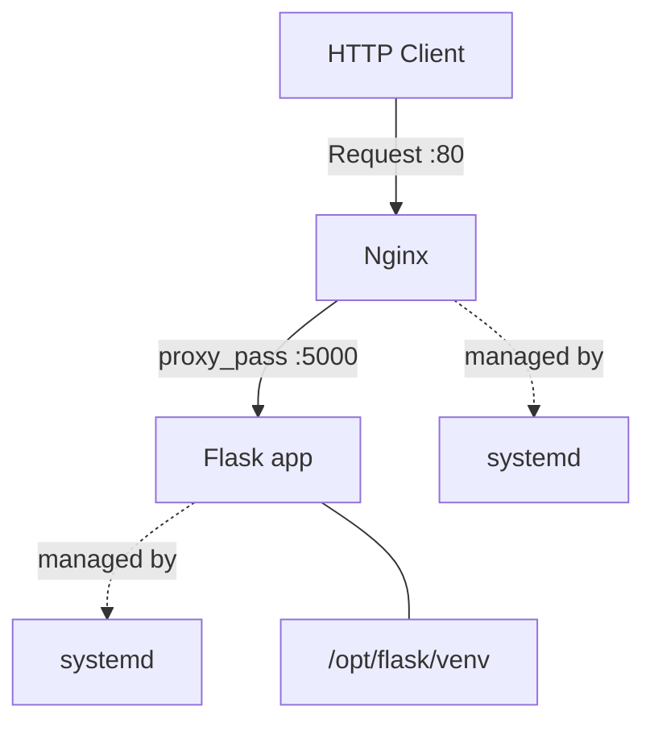

# Flask + Nginx deployment with Ansible


Infrastructure automation project using Ansible to deploy a Flask application behind Nginx as a reverse proxy, with systemd-managed services. Demonstrates a production-style deployment pattern in a minimal, reproducible setup.

---

## Why this matters

A Flask app sitting alone on port 5000 is a development setup, not a deployment. This project shows the minimum viable production pattern: Nginx as the public-facing reverse proxy, Flask running in an isolated virtual environment, and both services managed by systemd so they survive reboots and restarts. The same Ansible structure scales naturally to deploying ML model-serving APIs, internal tools, or any Python web service.

---

## Project structure

```
helloworld-ansible-flask-nginx/
├── deploy.yml              # Main playbook
├── inventory.yml           # Host inventory
├── vars/
│   └── main.yml            # Configuration variables
├── files/
│   └── app.py              # Flask application
└── templates/
    └── nginx.conf.j2       # Nginx configuration template
```

---

## Requirements

- Debian 12/13
- Ansible 2.9+
- Sudo access on the target host

---

## Configuration variables

| Variable | Default | Description |
| :--- | :--- | :--- |
| `flask_port` | `5000` | Port Flask listens on internally |

---

## What the playbook does

1. Installs Nginx as a reverse proxy listening on port 80
2. Installs Python 3 and creates an isolated virtual environment
3. Installs Flask inside the virtual environment
4. Copies the Flask application to `/opt/flask/`
5. Renders the Nginx configuration from a Jinja2 template to forward traffic to Flask
6. Creates a systemd service so Flask starts automatically on boot
7. Starts and enables both services

---

## Usage

### 1. Clone the repository

```bash
git clone git@github.com:Pedro-Sarmiento/helloworld-ansible-flask-nginx.git
cd helloworld-ansible-flask-nginx
```

### 2. Run the playbook

```bash
ansible-playbook -i inventory.yml deploy.yml --ask-become-pass
```

### 3. Test the application

```bash
curl http://localhost
```

Expected output:

```
Hello World
```

---

## Architecture



---

## Managed services

| Service | Port | Managed by |
| :--- | :--- | :--- |
| Nginx | 80 | systemd |
| Flask | 5000 (internal) | systemd |

---

## License

MIT
